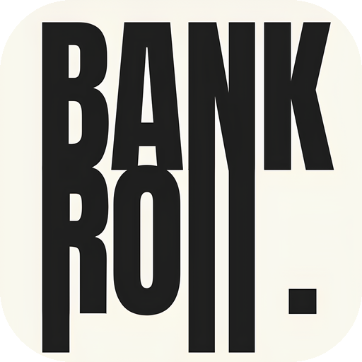
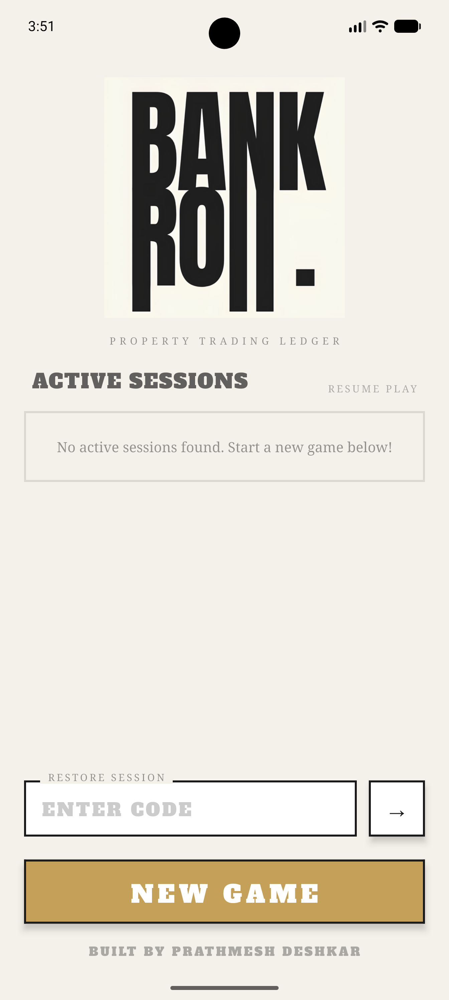
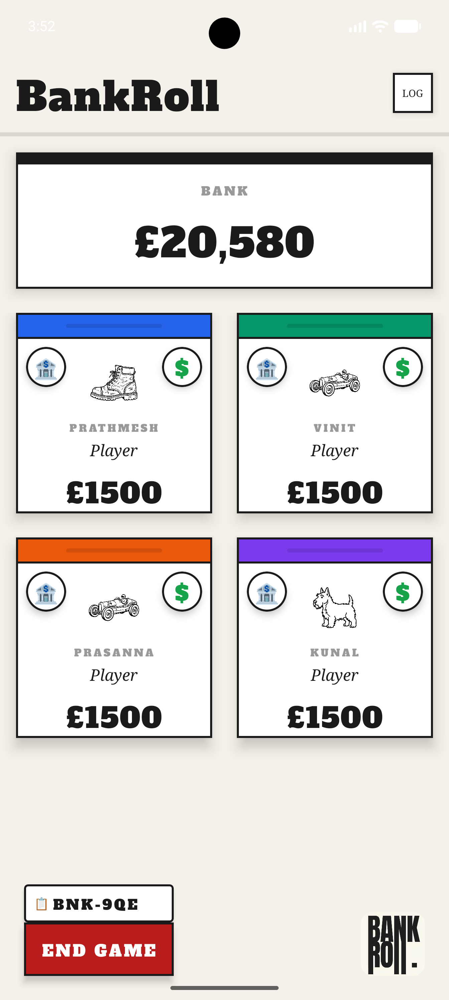
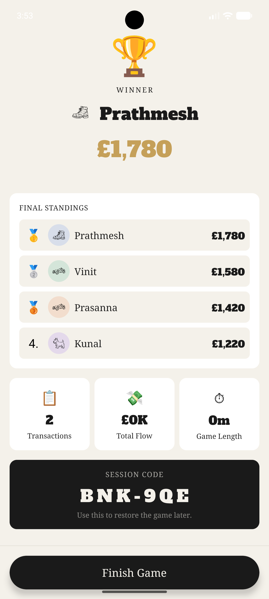

  

 

---

    

 

---

### App Preview

  
  
  

 

---

### Ditch the paper money.

*BankRoll is a premium, high-performance React Native application designed to act as a seamless digital ledger and property trading system for monopoly. Built with a modern **neobrutalist** aesthetic, it empowers players to manage balances, handle properties, and execute complex transfers entirely on one device.*

 

<table>
<tr>
<td width="25%" valign="top">

**Editions**
`US, UK, IN, AU`

Built-in property lists and currencies for the 4 most popular editions.

</td>
<td width="25%" valign="top">

**Performance**
`MMKV`

Lightning fast local state persistence and session recovery.

</td>
<td width="25%" valign="top">

**Transfers**
`Drag & Drop`

Intuitive drag and drop interface to initiate quick payments between players.

</td>
<td width="25%" valign="top">

**Rulesets**
`House Rules`

Customizable house rules including No Bankruptcy (-100 limit) and Infinite Bank Money.

</td>
</tr>
</table>

> **What makes BankRoll different**
> - Premium Neobrutalist design system with heavy borders and drop shadows
> - Instant automatic rent calculation based on house/hotel improvements
> - Draggable Player Cards to initiate swift transactions
> - Full session history and seamless state recovery

 

---

### What it does

<table width="100%">
  <tr>
    <td width="50%" valign="top" style="padding: 16px; border: 1px solid #d0d7de; border-radius: 10px;">
      <h3>Quick Pay Sheet</h3>
      Instantly transfer money between any two entities. Toggle to the "Rent" tab to auto-calculate exact rent based on the property's current improvement level.
    </td>
    <td width="4%"></td>
    <td width="50%" valign="top" style="padding: 16px; border: 1px solid #d0d7de; border-radius: 10px;">
      <h3>Property Management</h3>
      Every player can manage their properties directly from their card. Mortgage, Unmortgage, and track exactly how many assets are locked.
    </td>
  </tr>
  <tr><td colspan="3" height="10"></td></tr>
  <tr>
    <td width="50%" valign="top" style="padding: 16px; border: 1px solid #d0d7de; border-radius: 10px;">
      <h3>Beautiful Neobrutalist UI</h3>
      A striking, premium interface featuring stark borders, vibrant colors, and micro-interactions powered by React Native Reanimated.
    </td>
    <td width="4%"></td>
    <td width="50%" valign="top" style="padding: 16px; border: 1px solid #d0d7de; border-radius: 10px;">
      <h3>Session Recovery</h3>
      Close the app mid-game? No problem. Use the 6-character recovery code to instantly restore your entire game state.
    </td>
  </tr>
</table>

 

---

### Get started in 60 seconds

<table width="100%" cellspacing="0" cellpadding="0">
  <tr>
    <td width="36" valign="top" align="center">
      <strong>1</strong>
    </td>
    <td valign="top" style="padding-left: 12px;">
      <strong>Download the App</strong>  
      Navigate to the <a href="https://github.com/Prathmesh-D/BankRoll/releases/latest">Releases</a> section on GitHub and download <code>BankRoll-v1.0.2.apk</code>. 
      Install the APK on your Android device (ensure "Install from Unknown Sources" is enabled).  
    </td>
  </tr>
  <tr><td colspan="2" height="20"></td></tr>
  <tr>
    <td width="36" valign="top" align="center">
      <strong>2</strong>
    </td>
    <td valign="top" style="padding-left: 12px;">
      <strong>Setup a New Game</strong>  
      Launch the app and tap <strong>NEW GAME</strong>. Select your preferred Monopoly Edition (US, UK, IN, AU), add player names, choose your favorite vintage token avatars, and set your House Rules (like the -100 debt limit or infinite bank money).  
    </td>
  </tr>
  <tr><td colspan="2" height="20"></td></tr>
  <tr>
    <td width="36" valign="top" align="center">
      <strong>3</strong>
    </td>
    <td valign="top" style="padding-left: 12px;">
      <strong>Play & Transfer</strong>  
      <strong>Drag & Drop:</strong> Long press any player's card (or the Bank) and drag it over another player to initiate a Quick Pay transfer. 
      <strong>One-Tap Rent:</strong> Inside the transfer sheet, toggle to "RENT CALC" to auto-calculate exact rent based on property improvements.  
    </td>
  </tr>
</table>

 

---

Built by **[Prathmesh Deshkar](https://github.com/Prathmesh-D)**

*If it was useful or interesting, a star is always appreciated.*

---

